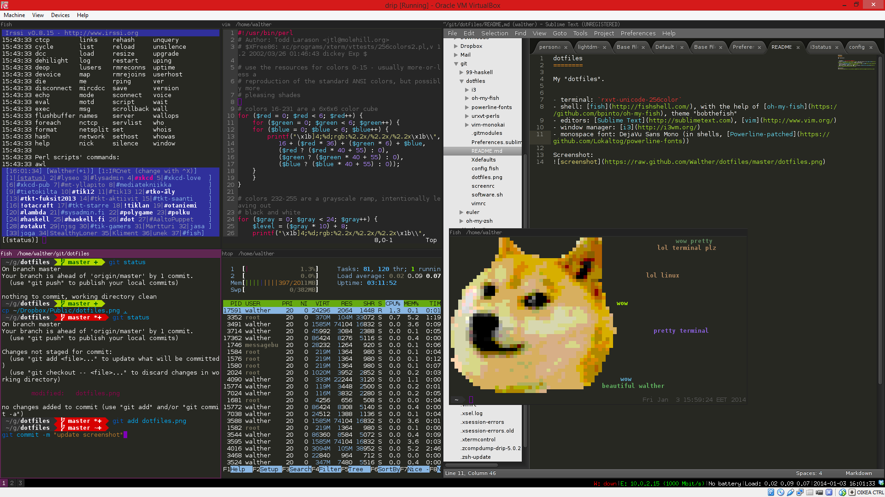

dotfiles
========

My "dotfiles".

- terminal: [rxvt-unicode-256color](http://software.schmorp.de/pkg/rxvt-unicode.html)
- shell: [fish](http://fishshell.com/), with the help of [oh-my-fish](https://github.com/bpinto/oh-my-fish), theme bobthefish
- editors: [Sublime Text 3](http://sublimetext.com/3), [vim](http://www.vim.org/)
- tiling window manager: [i3](http://i3wm.org/)
- fonts: DejaVu Sans, DejaVu Sans Mono - with [Powerline patch](https://github.com/Lokaltog/powerline-fonts) for fancy glyphs)
- color theme: Monokai

Screenshot:
